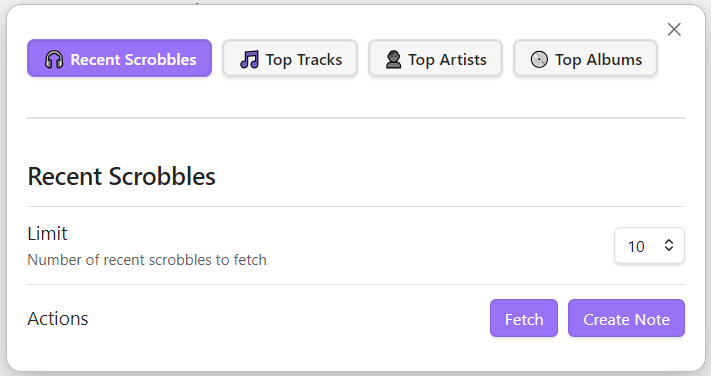

# Last.fm Integration for Obsidian

Fetch data and create notes from your **Last.fm listening history** directly inside Obsidian.

This plugin lets you fetch:

**Recent scrobbles**  
**Top tracks, artists, and albums** (for any Last.fm period)  
**Weekly charts** (from → to weekly ranges via Last.fm’s API)  
**Album artwork** (available for recent scrobbles and top albums)  
Automatically generate Markdown notes into your chosen folder

---

## 📸 Preview

  

---

## ✨ Features

- **Recent scrobbles**
  - Most recent tracks you scrobbled (includes artwork of each track's album)
  - Select the number of tracks you want to pull from Last.fm (5, 10, 20, 50, 100)
- **Top Tracks / Artists / Albums**
  - Period-based (7day, 1month, 3month, 6month, 12month, overall)
  - Set a custom limit for how many results to fetch
- **Weekly charts**
  - Real chart-based weekly ranges from Last.fm (up to 20 years back !)
- **Automatic note creation**
  - Create notes to persist data in your vault
  - Choose a folder in which notes will be created
- **Album art included** when available (recent plays & top albums only)
- Clean UI modal with tabs
- Ribbon icon for quick access
- Fully local — only Last.fm API requests are made

---

## 🔧 Setup

1. Get a Last.fm API key  
   https://www.last.fm/api/account/create

2. In Obsidian:
   - Open **Settings → Community Plugins**
   - Enable **Third-party plugins**
   - Install this plugin manually (see below)
   - Enter your **API key**, **username**, and **output folder**

---

## 📦 Manual Installation

1. Clone this repo

2. Make sure your NodeJS is at least v16 (node --version)

3. `npm i` to install dependencies

4. `npm run build` to compile the code

5. Copy `main.js`, `styles.css`, `manifest.json` to your vault `VaultFolder/.obsidian/plugins/obsidian-lastfm-plugin/`

6. Reload Obsidian and enable the plugin.

---

## 🧾 License

MIT

---

## 🙏 Credits

Built by **Gorka Gómez**  
Uses the Last.fm public API.

---

## ⭐ Support

If you enjoy this plugin, consider starring the repo on GitHub!
